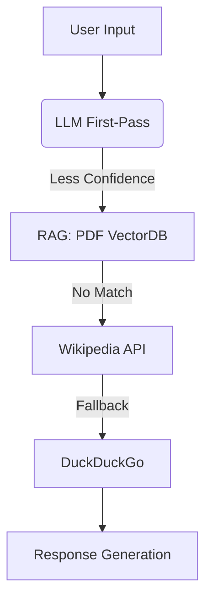

# 🩺 MediGenius: AI Medical Assistant
An industry-grade, compassionate Medical Assistant with conversational memory that simulates a human doctor using **LLM + RAG + Wikipedia + DuckDuckGo fallback** pipeline. This system ensures the best possible medical response through reliable fallback strategies.


---

## 🚀 Features

- 🤖 **Doctor-like medical assistant** with conversational memory
- 🧠 **LLM-powered primary response** engine
- 📚 **RAG (Retrieval-Augmented Generation)** using domain-specific PDF medical documents
- 🌐 **Wikipedia fallback** if documents are insufficient
- 🔎 **DuckDuckGo fallback** if Wikipedia has no answer
- 🗂️ **Vector database (ChromaDB)** to persist embeddings
- 🔁 Session-based memory using Streamlit state
- 📜 Logging with full traceback (file + console)
- 🔒 Confidential, local-only execution

---

## 🧱 Project Architecture

```
User Query
   ↓
[Step 1] LLM → Tries to answer with context only
   ↓
[Step 2] RAG (ChromaDB) → If LLM not confident
   ↓
[Step 3] Wikipedia API → If no relevant vector match
   ↓
[Step 4] DuckDuckGo Search → If Wikipedia has no relevant answer
   ↓
Final Answer → LLM generates doctor-like response
```

---

## 🗂️ Folder Structure

```
MediGenius/
├── config/
│   |── settings.py                  # Path config, base directory
│   |── logging.conf                 # Logging configuration
│   └── __init__.py                  # Initialization
│
├── data/
│   └── medical_book.pdf             # PDF data source
│
├── docs_db/                         # Vector database (ChromaDB)
│
├── modules/                         # Modular logic components
│   ├── __init__.py
│   ├── document_processing.py
│   ├── llm_models.py
│   ├── retrieval_tools.py
│   ├── state_management.py
│   └── workflow.py
│
├── logs/
│   └── medical_chatbot.log           # Log file
│
├── utils/
│   ├── __init__.py
│   └── helpers.py                    
│
├── notebook/
│   └── experiment.ipynb                                  
│
├── test/
│   └── test_app.py
│
├── .github/                           # GitHub specific files
│   └── workflows/
│       └── main.yml                   # GitHub Actions CI/CD workflow file
│
├── Dockerfile                         # Docker build file
├── requirements.txt                   # Python dependencies
├── app.py                             # Main Streamlit app
├── main.py                            # Main script
├── setup.py                           # Python setup file
├── README.md                          # Project Documentation
├── .gitignore                         
├── app.png                            # Demo
└── LICENSE                            # License
```

---

## 🧠 Module Responsibilities

| Module                  | Responsibility |
|------------------------|----------------|
| `llm_models.py`        | Loads LLM (e.g., LLaMA-3), manages embeddings |
| `document_processing.py` | Loads/splits PDF, prepares docs for RAG |
| `retrieval_tools.py`   | Builds & queries vector DB (ChromaDB) |
| `state_management.py` | Stores & updates session states |
| `workflow.py`          | Executes the 4-level fallback pipeline |
| `helpers.py`           | Handles Wikipedia + DuckDuckGo API logic |

---

## ⚙️ How to Run Locally

1. **Clone the repo**
```bash
git clone https://github.com/Md-Emon-Hasan/MediGenius.git
cd medical-ai-assistant
```

2. **Install dependencies**
```bash
pip install -r requirements.txt
```

3. **Run the app**
```bash
streamlit run app.py
```

Make sure the following files exist:
- `data/medical_book.pdf`
- `docs_db/` (already populated vectorstore)

---

## 👨‍💻 Architecture Diagram


## 🔍 Fallback Flow (Detailed)

```text
Step 1️⃣ → LLM only (no context)
   ↳ Confident answer → Return
   ↳ Not confident → Go to Step 2

Step 2️⃣ → RAG (Vector Search from PDF)
   ↳ Relevant chunk found → Use in LLM prompt → Return
   ↳ No relevant doc → Go to Step 3

Step 3️⃣ → Wikipedia Search
   ↳ Summary found → Feed to LLM → Return
   ↳ No good result → Go to Step 4

Step 4️⃣ → DuckDuckGo Search
   ↳ Extract snippet URLs/text → Summarize → LLM final answer
```

---

## 🧪 Sample Prompt

```text
"What are the symptoms of dengue fever, and how is it diagnosed?"
```

The system will:
- Try to generate an answer on its own
- If unsure, pull from the PDF medical book
- If still not found, get from Wikipedia
- Finally fallback to DuckDuckGo

---

## 🧭 Future Improvements

- 🎙️ Add voice input/output
- 🖼️ Add image upload for reports or prescriptions
- 🧬 Integrate with real-time medical APIs (e.g., WebMD)
- 🔐 Add user authentication & role-based chat memory

---

## 👨‍💻 Developed By

**Md Emon Hasan**  
📧 **Email:** iconicemon01@gmail.com  
💬 **WhatsApp:** [+8801834363533](https://wa.me/8801834363533)  
🔗 **GitHub:** [Md-Emon-Hasan](https://github.com/Md-Emon-Hasan)  
🔗 **LinkedIn:** [Md Emon Hasan](https://www.linkedin.com/in/md-emon-hasan)  
🔗 **Facebook:** [Md Emon Hasan](https://www.facebook.com/mdemon.hasan2001/)

---

## 📜 Disclaimer

This application is for **informational and educational purposes only**. It is not a substitute for professional medical advice, diagnosis, or treatment. Always consult a licensed physician for serious medical concerns.

---

## 📌 License
MIT License. Free to use with credit.