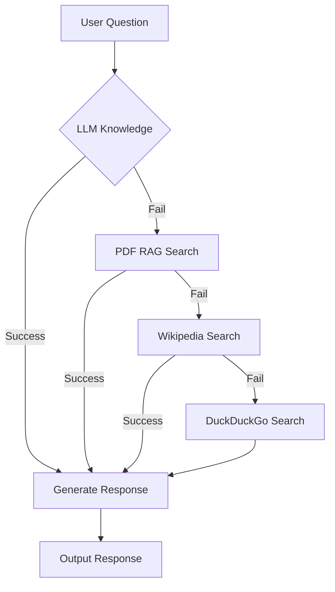

# 🩺 MediGenius: AI Medical Assistant
Medical Assistant with conversational memory that simulates a human doctor using **LLM + RAG + Wikipedia + DuckDuckGo fallback** pipeline. This system ensures the best possible medical response through reliable fallback strategies.


## 🎯 Objective
The goal of this project is to design and deploy an **end-to-end AI-powered Medical Assistant** that can engage in **empathetic, intelligent, and privacy-conscious** doctor-patient-style conversations.

This assistant is powered by **LLaMA-3** and uses **LangGraph** for agentic reasoning and orchestration. It combines **RAG (Retrieval-Augmented Generation)** techniques to retrieve accurate and up-to-date medical information from multiple trusted sources, such as **ingested medical PDFs**, **Wikipedia**, and **real-time DuckDuckGo search results**.

The system maintains **short-term conversation memory** to understand context across multiple user queries and responds in a **human-like**, emotionally supportive tone. It avoids over-reliance on citations or cold, fact-dumping responses — instead, it prioritizes **clarity, compassion, and usefulness**, mimicking the experience of consulting a real doctor.

---

## 🔗 **Live Demo**

You can interact with the live AI-powered medical assistant here:
👉 [https://medigenius.onrender.com/](https://medigenius.onrender.com/)

---

## 🌍 Real-World Use Cases

1. **Rural Health Access**
   Providing preliminary medical advice in rural or underserved areas where certified doctors may not be immediately available.

2. **Mental Health First Aid**
   Offering supportive conversations for users dealing with stress, anxiety, or medical confusion.

3. **Patient Pre-screening**
   Collecting and analyzing symptoms before a user visits a doctor, reducing clinical workload.

4. **Home Care Guidance**
   Guiding patients and caregivers on medication usage, symptoms, or recovery advice.

5. **Educational Assistant**
   Helping medical students or patients understand medical topics in simpler language.

---

## 🚀 Features

- 🤖 **Doctor-like medical assistant** with conversational memory
- 🧠 **LLM-powered primary response** engine
- 📚 **RAG (Retrieval-Augmented Generation)** using domain-specific PDF medical documents
- 🌐 **Wikipedia fallback** if documents are insufficient
- 🔎 **DuckDuckGo fallback** if Wikipedia has no answer
- 🗂️ **Vector database (ChromaDB)** to persist embeddings
- 🔁 Session-based memory using Streamlit state
- 📜 Logging with full traceback (file + console)
- 🔒 Rest API for integration with other systems

---

## 🗂️ Technical Stack

| **Category**               | **Technology/Resource**                                                                 |
|----------------------------|----------------------------------------------------------------------------------------|
| **Core Framework**         | LangChain, LangGraph                                                                   |
| **LLM Provider**           | Groq (Llama-3-70b)                                                                     |
| **Embeddings Model**       | HuggingFace (sentence-transformers/all-MiniLM-L6-v2)                                   |
| **Vector Database**        | ChromaDB (with cosine similarity)                                                      |
| **Document Processing**    | PyPDFLoader (PDF), RecursiveCharacterTextSplitter                                      |
| **Search Tools**           | Wikipedia API, DuckDuckGo Search                                                       |
| **Conversation Flow**      | State Machine (LangGraph) with 4-stage fallback                                        |
| **Medical Knowledge Base** | Custom PDF documents + Wikipedia medical content                                       |
| **Environment**            | python-dotenv (environment variables)                                                  |
| **Hosting**                | Local (development), Streamlit Cloud (deployment)                                      |

---

## 🗂️ Folder Structure

```
MediGenius/
├── config/
│   |── settings.py                  # Path config, base directory
│   |── logging.conf                 # Logging configuration
│   └── __init__.py                  # Initialization
│
├── data/
│   └── medical_book.pdf             # PDF data source
│
├── docs_db/                         # Vector database (ChromaDB)
│
├── modules/                         # Modular logic components
│   ├── __init__.py
│   ├── document_processing.py
│   ├── llm_models.py
│   ├── retrieval_tools.py
│   ├── state_management.py
│   └── workflow.py
│
├── logs/
│   └── medical_chatbot.log           # Log file
│
├── utils/
│   ├── __init__.py
│   └── helpers.py                    
│
├── notebook/
│   └── experiment.ipynb                                  
│
├── test/
│   └── test_app.py
│
├── .github/                           # GitHub specific files
│   └── workflows/
│       └── main.yml                   # GitHub Actions CI/CD workflow file
│
├── Dockerfile                         # Docker build file
├── requirements.txt                   # Python dependencies
├── app.py                             # Main Streamlit app
├── FastAPI.py                         # FastAPI app
├── main.py                            # Main script
├── setup.py                           # Python setup file
├── README.md                          # Project Documentation
├── .gitignore                         
├── app.png                            # Demo
├── demo.webm                          # Video Demo
└── LICENSE                            # License
```

---

## 🧱 Project Architecture



---

## **API Endpoints**

#### 1. **POST /ask/**
**Description**: 
Sends a medical question to the chatbot and receives a response.

- **URL**: `/ask/`
- **Method**: `POST`
- **Request Body**:
    - **Content-Type**: `application/json`
    - **Body (JSON)**:
    ```json
    {
      "question": "What are the symptoms of diabetes?"
    }
    ```

- **Response**:
    - **Content-Type**: `application/json`
    - **Body (JSON)**:
    ```json
    {
      "role": "doctor",
      "content": "Diabetes symptoms include increased thirst, frequent urination, fatigue, and blurred vision."
    }
    ```

- **Status Codes**:
    - `200 OK`: Successfully processed the question and returned a response.
    - `400 Bad Request`: Invalid or missing parameters in the request.
    - `500 Internal Server Error`: Unexpected server error.

#### 2. **GET /conversation/**
**Description**: 
Fetches the entire conversation history.

- **URL**: `/conversation/`
- **Method**: `GET`
- **Response**:
    - **Content-Type**: `application/json`
    - **Body (JSON)**:
    ```json
    {
      "conversation": [
        {
          "role": "user",
          "content": "What are the symptoms of diabetes?"
        },
        {
          "role": "doctor",
          "content": "Diabetes symptoms include increased thirst, frequent urination, fatigue, and blurred vision."
        }
      ]
    }
    ```

- **Status Codes**:
    - `200 OK`: Successfully fetched the conversation history.
    - `500 Internal Server Error`: Unexpected server error.

#### 3. **POST /reset/**
**Description**: 
Resets the conversation state.

- **URL**: `/reset/`
- **Method**: `POST`
- **Request Body**:
    - **Content-Type**: `application/json`
    - **Body**: 
    ```json
    {}
    ```

- **Response**:
    - **Content-Type**: `application/json`
    - **Body (JSON)**:
    ```json
    {
      "message": "Conversation reset successfully"
    }
    ```

- **Status Codes**:
    - `200 OK`: Conversation successfully reset.
    - `500 Internal Server Error`: Unexpected server error.

---

## 🔍 Fallback Flow (Detailed)

```text
Step 1️⃣ → LLM only (no context)
   ↳ Confident answer → Return
   ↳ Not confident → Go to Step 2

Step 2️⃣ → RAG (Vector Search from PDF)
   ↳ Relevant chunk found → Use in LLM prompt → Return
   ↳ No relevant doc → Go to Step 3

Step 3️⃣ → Wikipedia Search
   ↳ Summary found → Feed to LLM → Return
   ↳ No good result → Go to Step 4

Step 4️⃣ → DuckDuckGo Search
   ↳ Extract snippet URLs/text → Summarize → LLM final answer
```

---

## 🧪 Sample Prompt

```text
"What are the symptoms of dengue fever, and how is it diagnosed?"
```

The system will:
- Try to generate an answer on its own
- If unsure, pull from the PDF medical book
- If still not found, get from Wikipedia
- Finally fallback to DuckDuckGo

---

## 🧭 Future Improvements

- 🎙️ Add voice input/output
- 🖼️ Add image upload for reports or prescriptions
- 🧬 Integrate with real-time medical APIs (e.g., WebMD)
- 🔐 Add user authentication & role-based chat memory

---

## 👨‍💻 Developed By

**Md Emon Hasan**  
📧 **Email:** iconicemon01@gmail.com  
💬 **WhatsApp:** [+8801834363533](https://wa.me/8801834363533)  
🔗 **GitHub:** [Md-Emon-Hasan](https://github.com/Md-Emon-Hasan)  
🔗 **LinkedIn:** [Md Emon Hasan](https://www.linkedin.com/in/md-emon-hasan-695483237/)  
🔗 **Facebook:** [Md Emon Hasan](https://www.facebook.com/mdemon.hasan2001/)

---

## 📜 Disclaimer

This application is for **informational and educational purposes only**. It is not a substitute for professional medical advice, diagnosis, or treatment. Always consult a licensed physician for serious medical concerns.

---

## 📌 License
MIT License. Free to use with credit.