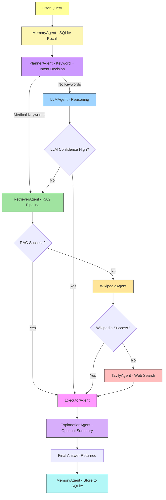

# **MediGenius: AI-Powered Multi-Agent Medical Assistant**

**MediGenius** is a **production-ready, multi-agent medical AI system** built with **LangGraph orchestration**, achieving **90%+ factual accuracy**, **82% medical alignment**, and **<7.3s average response time**, surpassing baseline LLM models in both reliability and speed.

The system employs **Planner, Retriever, Answer Generator, Tool Router**, and **Fallback Handler Agents** that coordinate intelligently across diverse tools — combining **medical RAG from verified PDFs**, and **fallback web searches** to ensure accuracy even when the LLM falters.

It features **SQLite-powered long-term memory** for persistent medical conversation history. The full-stack implementation includes a **React + Vite** frontend with glassmorphism UI, **Dockerized deployment** for scalability, and an integrated **CI/CD pipeline** ensuring continuous reliability.

---

## **Performance Evaluation & Benchmarking**

| **Metrics**               | **MediGenius** | **LLaMA 3.1 70B (Baseline)** |
| ------------------------- | --------------------------- | ------------------------------------------------------------------------------------------------------------------------------------------------ |
| **Success Rate**          | **80–94 %**                 | **79–90 %**                                                                                                                                      |
| **Average Response Time** | **7.23 seconds**            | **22.8 seconds**                                                                                                                                 |
| **Medical Terms Usage**   | **80.0 %**                  | **80.0 %**                                                                                                                                       |
| **Completeness Rate**     | **100 %**                   | **100 %**                                                                                                                                        |
| **Source Attribution**    | **100 %**                   | **100 %**                                                                                                                                        |

---

## **Technical Stack**

| **Category**               | **Technology**                                                                                   |
|----------------------------|----------------------------------------------------------------------------------------------------------|
| **Core Framework**         | LangChain, LangGraph (Multi-Agent Orchestration)                                                          |
| **LLM Provider**           | Groq (Llama-3.3-70B)                                                                                      |
| **Embeddings**             | HuggingFace (sentence-transformers/all-MiniLM-L6-v2)                                                     |
| **Vector Database**        | ChromaDB (Cosine similarity search)                                                                      |
| **Backend**                | FastAPI (Layered Architecture, Versioned API)                                                             |
| **Frontend**               | React + Vite + Tailwind CSS 4 + DaisyUI 5                                                                |
| **Persistence**            | SQLite (SQLAlchemy ORM)                                                                                  |
| **DevOps**                 | Docker, Docker Compose, GitHub Actions (CI/CD)                                                           |

---

## **📂 Project File Structure**

```text
MediGenius/
├── .github/
│   └── workflows/
│       └── ci-cd.yml             # GitHub Actions CI/CD Pipeline
├── backend/
│   ├── app/
│   │   ├── agents/               # LangGraph Agent logic
│   │   │   ├── state.py          # Workflow state definitions
│   │   │   └── ...               # Individual agent implementations
│   │   ├── api/                  # API Layer
│   │   │   ├── v1/               # Versioned API (v1)
│   │   │   │   ├── endpoints/    # Modular endpoint logic
│   │   │   │   │   ├── chat.py
│   │   │   │   │   ├── health.py
│   │   │   │   │   └── session.py
│   │   │   │   ├── api.py        # Router aggregator
│   │   │   │   └── __init__.py
│   │   │   └── __init__.py
│   │   ├── core/                 # Core configurations
│   │   │   ├── langgraph_workflow.py
│   │   │   ├── logging_config.py
│   │   │   ├── state.py
│   │   │   └── __init__.py
│   │   ├── db/                   # Database Session Management
│   │   │   ├── session.py
│   │   │   └── __init__.py
│   │   ├── models/               # SQLAlchemy Models
│   │   │   ├── message.py
│   │   │   └── __init__.py
│   │   ├── schemas/              # Pydantic Schemas
│   │   │   └── __init__.py
│   │   ├── services/             # Business Logic Services
│   │   │   ├── chat_service.py
│   │   │   ├── database_service.py
│   │   │   └── __init__.py
│   │   ├── tools/                # Agentic Tools (RAG, Search)
│   │   │   ├── duckduckgo_search.py
│   │   │   ├── pdf_loader.py
│   │   │   ├── vector_store.py
│   │   │   ├── wikipedia_search.py
│   │   │   └── __init__.py
│   │   ├── main.py               # Application Entry Point
│   │   └── __init__.py
│   ├── database/                 # Production Data (Git Ignored)
│   │   ├── medigenius.db         # SQLite DB
│   │   └── medical_db/           # ChromaDB Vector Store
│   ├── logs/                     # Rotation Logs
│   ├── tests/                    # Backend Test Suite
│   │   ├── test_database/        # Isolated Test DB
│   │   ├── conftest.py           # Pytest Fixtures
│   │   ├── pytest.ini            # Pytest Config
│   │   ├── test_agents.py
│   │   ├── test_api.py           # v1 API integration tests
│   │   ├── test_database.py
│   │   ├── test_logging.py
│   │   ├── test_services.py
│   │   └── test_workflow.py
│   ├── Dockerfile                # Multi-stage Backend Build
│   ├── pyproject.toml            # Tooling Config (isort, etc.)
│   └── requirements.txt          # Python Dependencies
├── frontend/
│   ├── public/                   # Static sensitive assets
│   ├── src/
│   │   ├── assets/               # UI assets
│   │   ├── components/           # React Components
│   │   │   ├── ChatArea.jsx      # Chat display logic
│   │   │   ├── InputArea.jsx     # User input handling
│   │   │   └── Sidebar.jsx       # Session Management UI
│   │   ├── App.jsx               # Main UI Orchestrator
│   │   ├── App.test.jsx          # Vitest Integration tests
│   │   ├── index.css             # Tailwind 4 Custom Styles
│   │   ├── main.jsx              # React Entry Point
│   │   └── setupTests.js         # Vitest Config
│   ├── Dockerfile                # Production Nginx Build
│   ├── nginx.conf                # Proxy & Routing Config
│   ├── package.json              # Node Dependencies
│   ├── postcss.config.js         # Tailwind v4 Compatibility
│   ├── tailwind.config.js        # Theme Presets
│   └── vite.config.js            # Build & Proxy Config
├── notebook/                     # Research & Development
├── docker-compose.yml            # Unified Stack Orchestration
├── run.py                        # Unified Local Dev Script
├── render.yml                    # Cloud Deployment Manifest
└── LICENSE                       # MIT License
```

---

## **🧬 Project Architecture**


```mermaid
graph TD
    A[User Query] --> B[MemoryAgent - SQLite Recall]
    B --> C[PlannerAgent - Keyword + Intent Decision]

    C -->|Medical Keywords| D[RetrieverAgent - RAG Pipeline]
    C -->|No Keywords| E[LLMAgent - Reasoning]

    D --> F{RAG Success?}
    F -->|Yes| G[ExecutorAgent]
    F -->|No| H[WikipediaAgent]

    E --> I{LLM Confidence High?}
    I -->|Yes| G
    I -->|No| D

    H --> J{Wikipedia Success?}
    J -->|Yes| G
    J -->|No| K[TavilyAgent - Web Search]

    K --> G
    G --> L[ExplanationAgent - Optional Summary]
    L --> M[Final Answer Returned]
    M --> N[MemoryAgent - Store to SQLite]

    style A fill:#ff9,stroke:#333
    style B fill:#fdf6b2,stroke:#333
    style C fill:#c9f,stroke:#333
    style D fill:#a0e3a0,stroke:#333
    style E fill:#9fd4ff,stroke:#333
    style H fill:#ffe599,stroke:#333
    style K fill:#ffbdbd,stroke:#333
    style G fill:#f9f,stroke:#333
    style L fill:#d7aefb,stroke:#333
    style N fill:#b3f7f7,stroke:#333
```

---

## **💡 Real-World Use Cases**

1. **Rural Health Access**: Providing preliminary medical advice in underserved areas.
2. **Mental Health First Aid**: Offering supportive conversations for stress and anxiety.
3. **Patient Pre-screening**: Analyzing symptoms before clinical visits.
4. **Home Care Guidance**: Advice on medication usage and recovery.

---

## **🚀 Running the Project**

### **Option 1: Unified Script (Local Dev)**
Run both Backend and Frontend with a single command:
```bash
python run.py
```
- **Backend API**: `http://localhost:8000/api/v1`
- **Frontend UI**: `http://localhost:5173`

### **Option 2: Docker (Production)**
```bash
docker-compose up --build
```
The Docker setup includes optimized builds and volume persistence for both SQLite and Vector stores.

---

## **🧪 Testing and Quality**

### **Backend Tests (Pytest)**
```bash
cd backend
python -m pytest tests/ -v
```
*Current coverage incluye Agents, Services, API v1, and Core logic (48/48 tests passing).*

### **Frontend Tests (Vitest)**
```bash
cd frontend
npm run test
```
*Validated UI components and API integration (11/11 tests passing).*

### **Linting & Sorting**
We use `flake8` for linting and `isort` for import organization to ensure industry-standard code quality.

---

## **🌐 API Endpoints (v1)**

### **POST** `/api/v1/chat`
Process a query through the multi-agent workflow.
- **Header**: `X-Session-ID` (optional for state tracking)
- **Request Body**: `{"message": "string"}`

### **GET** `/api/v1/history`
Retrieve chat history for the current session.

---

## **Developed By**
**Md Emon Hasan**  
[GitHub](https://github.com/Md-Emon-Hasan) | [LinkedIn](https://www.linkedin.com/in/md-emon-hasan-695483237/)
